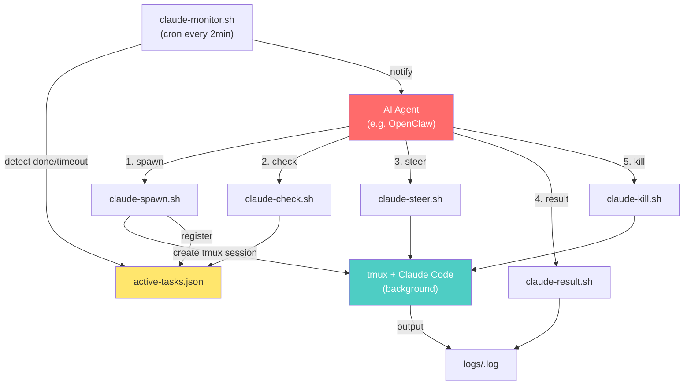

# clawclau

Async Claude Code task dispatcher via **tmux**. Bypass ACP protocol blocking for [OpenClaw](https://github.com/openclaw/openclaw) and other AI agents.

## Why?

When using OpenClaw (or any AI agent) to orchestrate [Claude Code](https://docs.anthropic.com/en/docs/claude-code) tasks, the ACP (Agent Communication Protocol) can deadlock — the agent waits for Claude Code, and Claude Code waits for user confirmation. Neither moves.

**clawclau** sidesteps this entirely by running Claude Code in isolated tmux sessions. The orchestrator spawns tasks asynchronously, checks results via log files, and gets notified when work is done. No synchronous handshake, no deadlock.

Inspired by [Elvis Sun's Agent Swarm architecture](https://x.com/elvissun/status/2025920521871716562).

## Features

- **Async task dispatch** — spawn Claude Code tasks without blocking
- **Mid-task steering** — send messages to running sessions via `tmux send-keys`
- **Automatic monitoring** — cron-based watchdog detects completion, timeout, and failure
- **Task registry** — JSON-based state tracking for all tasks
- **Configurable paths** — `CLAWCLAU_HOME` and `CLAWCLAU_SHELL` environment variables
- **Minimal dependencies** — just `bash`, `tmux`, and `jq`

## Prerequisites

| Tool | Install |
|------|---------|
| [Claude Code](https://docs.anthropic.com/en/docs/claude-code) | `npm install -g @anthropic-ai/claude-code` |
| [tmux](https://github.com/tmux/tmux) | `brew install tmux` (macOS) / `apt install tmux` (Linux) |
| [jq](https://stedolan.github.io/jq/) | `brew install jq` (macOS) / `apt install jq` (Linux) |

Claude Code must be authenticated and configured (API key or OAuth).

## Quick Start

```bash
# 1. Clone the repo
git clone https://github.com/BarryYJJ/clawclau.git
cd clawclau

# 2. Set up the working directory
export CLAWCLAU_HOME="$HOME/.clawclau"
mkdir -p "$CLAWCLAU_HOME/logs"
echo '[]' > "$CLAWCLAU_HOME/active-tasks.json"

# 3. (Optional) Add to your shell profile
echo 'export CLAWCLAU_HOME="$HOME/.clawclau"' >> ~/.zshrc
source ~/.zshrc

# 4. Dispatch a task
./claude-spawn.sh my-task "Refactor the auth module to use JWT" ~/my-project 300

# 5. Check status
./claude-check.sh my-task

# 6. Get results
./claude-result.sh my-task
```

## How It Works



## Script Reference

| Script | Usage | Description |
|--------|-------|-------------|
| `claude-spawn.sh` | `./claude-spawn.sh <id> "<prompt>" [workdir] [timeout]` | Spawn a new task |
| `claude-steer.sh` | `./claude-steer.sh <id> "<message>"` | Send message to running task |
| `claude-check.sh` | `./claude-check.sh [id]` | Check task status (all or single) |
| `claude-kill.sh` | `./claude-kill.sh <id>` | Terminate a running task |
| `claude-result.sh` | `./claude-result.sh <id>` | Read full task output |
| `claude-monitor.sh` | `./claude-monitor.sh` | Auto-detect completed/timeout tasks |

### Environment Variables

| Variable | Default | Description |
|----------|---------|-------------|
| `CLAWCLAU_HOME` | `~/.openclaw/workspace/.clawdbot` | Base directory for registry and logs |
| `CLAWCLAU_SHELL` | `bash` | Shell used to launch Claude Code in tmux |

## Monitoring

For automatic task detection, add `claude-monitor.sh` to cron:

```bash
# Edit crontab
crontab -e

# Add this line (run every 2 minutes):
*/2 * * * * /path/to/clawclau/claude-monitor.sh
```

The monitor will:
- Detect completed tasks (tmux session ended + log file has content)
- Kill tasks that exceed their timeout
- Notify via `openclaw system event` (if `openclaw` CLI is installed, otherwise silently skip)

## Task Lifecycle

```
running → done     (tmux ended, log has content)
running → failed   (tmux ended, log empty/missing)
running → timeout  (exceeded timeout limit)
running → killed   (manually terminated)
```

All state is tracked in `active-tasks.json`.

## Security

**`--dangerously-skip-permissions`** is used in `claude-spawn.sh` to bypass Claude Code's interactive permission prompts. This is necessary for non-interactive automation, but it means:

- Claude Code can execute any shell command without approval
- Claude Code can read/write any file it has access to
- Only use this in trusted, sandboxed environments

If you need permission checks, modify `claude-spawn.sh` to remove the flag and handle Claude Code's interactive prompts manually.

## Troubleshooting

| Problem | Solution |
|---------|----------|
| `command not found: tmux` | Install tmux: `brew install tmux` or `apt install tmux` |
| `command not found: claude` | tmux shell can't find Claude Code. Ensure `CLAWCLAU_SHELL` is set to your login shell (e.g., `zsh` or `bash`) |
| Task spawned but no output | Claude Code may take 20-30 seconds to start (API proxy latency). This is normal. |
| tmux session stays open after task completes | This shouldn't happen with the `; exit` at the end of the command. Check your shell config. |
| Prompt with quotes breaks spawn | Escape inner quotes or use a file: `./claude-spawn.sh task "$(cat prompt.txt)"` |
| macOS: `timeout` command not found | This project doesn't use `timeout`. If you need it: `brew install coreutils` |
| Registry file missing | `claude-spawn.sh` auto-creates it. If other scripts complain, run: `echo '[]' > "$CLAWCLAU_HOME/active-tasks.json"` |

## License

[MIT](LICENSE)
